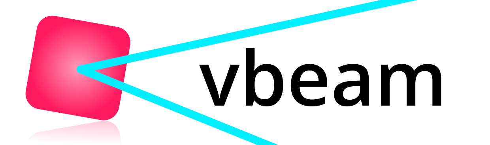

# vbeam: a Fast and Differentiable Beamformer for Optimizing Ultrasound Imaging


vbeam is an open-source beamforming library built on top of machine learning frameworks. This enables fast processing, rapid prototyping, and integrating beamforming into machine learning algorithms.


# Run An Example In Google Colab (In Your Browser)
Run one of the examples in your browser via Google Colab:

**(Make sure to select an A100 (or V100 if not available) GPU to make the examples run fast!)**

- [ Time-domain REFoCUS with a heterogeneous speed-of-sound map.](https://colab.research.google.com/github/magnusdk/vbeam/blob/c78d57651ffa75209e6bfa80cb8b213f1fe0678b/docs/examples/refocus_with_speed_of_sound_map.ipynb#scrollTo=4maDNPWwvZS4)
- [ Plane wave imaging (PWI) of a PICMUS dataset.](https://colab.research.google.com/github/magnusdk/vbeam/blob/main/docs/examples/plane_wave_dataset.ipynb)
- [ Retrospective transmit beamforming (RTB) with optimized scans.](https://colab.research.google.com/github/magnusdk/vbeam/blob/main/docs/examples/optimized_scans.ipynb)


# Installation
```bash
python3 -m pip install vbeam
```

**You probably also want to install JAX**. See [JAX installation instructions](https://github.com/google/jax#installation) for how to do so.


# IUS 2023 Q&A and Discussion
[Visit the GitHub Discussion page for IUS 2023 if you have any questions!](https://github.com/magnusdk/vbeam/discussions/8)


# Overview
vbeam is a pixel-based beamformer. This means that it centers around [a function called `signal_for_point`](https://github.com/magnusdk/vbeam/blob/main/vbeam/core/kernels.py#L26) which returns the delayed, interpolated signal for a single point/pixel. To get a full image, simply repeat `signal_for_point` for all pixels, all receiving elements, transmitted waves, frames, etc.

We take advantage of [JAX](https://github.com/google/jax)'s `vmap` transformation to call `signal_for_point` in parallel on the GPU. vbeam is a _"vmapped beamformer"_, hence the name.

We refer to the dimensions of our data by name, using [a library called spekk](https://github.com/magnusdk/spekk). This lets us write beamforming code that looks like this:

```python
beamformer = compose(
    signal_for_point,
    # Make it run in parallel for all points (pixels), sending-, and receiving- elements
    ForAll("points"),
    ForAll("senders"),
    ForAll("receivers"),
    # We sum over all sending-, and receiving- elements
    Apply(jnp.sum, [Axis("senders"), Axis("receivers")]),
    # Iteratively sum the result of each transmit event to reduce memory usage
    Reduce.Sum("transmits"),
    # Postprocessing
    Apply(setup.scan.unflatten),  # Points are flattened by default; reshape them back
    Apply(normalized_decibels),  # Decibels, and the maximum value is normalized to 0 dB
    Apply(scan_convert, setup.scan),  # Scan convert from beam-space to cartesian space
    # Just-in-time compile the function
    Wrap(jax.jit),
    # Build the function to let vbeam know about the dimensions of the input data
).build(setup.spec)
```

But usually, vbeam's out-of-the-box beamformer will be enough:

```python
beamformer = jax.jit(get_das_beamformer(setup))
```

The above example refers to 4 dimensions: `"points"`, `"senders"`, `"receivers"`, and `"transmits"`. In this case, `"senders"` refers to the individual contributing elements used during wave transmission, and is part of [our time-domain REFoCUS implementation ](https://colab.research.google.com/github/magnusdk/vbeam/blob/c78d57651ffa75209e6bfa80cb8b213f1fe0678b/docs/examples/refocus_with_speed_of_sound_map.ipynb#scrollTo=4maDNPWwvZS4). vbeam allows you to run any arbitrary dimension in parallel as part of your beamformer: perhaps you want to beamform multiple frames in parallel, or with multiple F#s.

If you want to use a different wavefront model, or a different apodization function, you simply pass in the new object when you call the beamformer:

```python
kwargs = setup.data
kwargs["apodization"] = MyCustomApodization()
result = beamformer(**kwargs)
```

Every beamforming component in vbeam is differentiable, so you can use vbeam to optimize your beamforming algorithm using gradient descent. You can also integrate machine learning into your beamformer, or integrate beamforming as a step in your machine learning algorithm. Using JAX, it is easy to get the gradient of any of the beamformer arguments:

```python
from vbeam.util.jax import grad_for_argname

# Minimize the pixel-values (just for illustration purposes) of the beamformed image by 
# "optimizing" the apodization:
my_loss = lambda **kwargs: jnp.sum(beamformer(**kwargs))
loss_grad = grad_for_argname(my_loss, "apodization")
```

# Documentation
You can read the [documentation of vbeam's core here](https://vbeam.readthedocs.io/en/latest/vbeam/core.html).

# Citing vbeam
If you use vbeam in your research, please cite the following paper:
```
Please wait for the in-proceedings article to be published :)
```