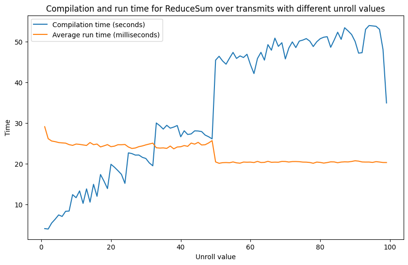

_Edit 17.01.2023: `ReduceSum` has been generalized as `Reduce`. To get the same results as before we can call `Reduce.Sum`._

Until very recently vbeam has not been properly profiled. The reason for this is that we have had the priviledge of not having to think about optimization as vbeam ran pretty fast from the get-go. This is largely due to the excellent JAX library, which automatically compiles and optimizes our code for us.

Recently we have started working with bigger datasets, i.e. datasets with more elements and/or transmits and with bigger grids. In combination with experimenting with REFoCUS the memory requirement has significantly increased, to the point where our code crashes because it tries to allocate >1TB of GPU memory.

For profiling average run time we simply use `time.perf_counter()` in the Python standard library, or the `%timeit` notebook magic. For more fine-grained profiling we use the [built-in JAX profiling tool](https://jax.readthedocs.io/en/latest/profiling.html) with [perfetto.dev](perfetto.dev) which lets us see which function(s) we spent the most time in. For memory profiling we use the excellent [memray by Bloomberg](https://github.com/bloomberg/memray) ([the default device memory profiling tool in JAX](https://jax.readthedocs.io/en/latest/device_memory_profiling.html) was found to not capture all allocated memory, though this may be my fault — memray worked out of the box for me so it is what I continued using).


## Reducing memory usage
The core of a beamformer is:
```python
[
    specced_signal_for_point,
    ForAll("points"),
    ForAll("receivers"),
    ForAll("transmits"),
    Apply(np.sum, Axis("receivers")),
    Apply(np.sum, Axis("transmits")),
]
```

That is, we create a datacube with size (Np x Nr x Nt) where Np, Nr, and Nt are the number of points, receivers, and transmits, respectively, before summing the receivers (usually) and summing the transmits (coherent compounding). The true size of this datacube differs between datasets, but it is reasonable to expect its size to be >1e9 *(for example 256x256=65536 points, 128 receivers and 128 transmits => (65536 x 128 x 128)=1.07e9)*. We are usually working with IQ-data, and thus complex 64-bit (8 bytes) numbers, meaning that the datacube alone needs ~8GB of memory.

Using a lot memory not only risks running out of memory, but it may also cause a lot of cache misses. When there are a lot of cache misses the GPU has to move a lot of data in and out of memory which reduces performance.

Given that we usually just sum over receivers and transmits we can process each slice of the dimension one at a time and iteratively sum the results. This should reduce the memory usage by a factor equal to the size of the dimension being iterated over as we only have to hold a single data slice in memory at a time, overwriting it with the new partially summed result at each iteration.

Let's introduce the new experimental beamforming step called `Reduce` (and corresponding `Reduce.Sum`):
```python
[
    specced_signal_for_point,
    ForAll("points"),
    ForAll("receivers"),
    Apply(np.sum, Axis("receivers")),
    Reduce.Sum("transmits", unroll=1),
]
```

`Reduce` is currently exclusive to JAX because it uses the `jax.lax.scan` function. Semantically, it is the same as running a regular Python for-loop, except that it runs on the GPU and that it compiles much faster (with `jax.jit`).

In fact, we could have just used a regular for-loop and JAX would have been able to trace the code just fine, except that compilation would have taken a long time. When JAX traces our code it can only see the operations performed on JAX arrays — e.g. the iteration of `i` in `for i in range(100):...` is transparent to JAX as `i` is a Python int, not an JAX array. Given the code:
```python
for i in range(6):
    arr += i
```

If `arr` is a JAX array, what JAX really sees (when tracing the code) is this:
```python
(((((arr + 0) + 1) + 2) + 3) + 4) + 5
```

This is called [*"unrolling"* the for-loop](https://en.wikipedia.org/wiki/Loop_unrolling). For sufficiently large loops JAX will take a long time to parse and optimize the traced code during compilation. `jax.lax.scan` lets JAX know that we are running a loop and so the traced code becomes much smaller and faster to compile.

However (to complicate matters), there are benefits of unrolling the for-loop even though the compilation time increases. Disregarding the body of the loop, `for i in range(5): ...` has to at some level increment `i` for each iteration and check whether `i>=5`. Unrolled loops don't have to know about looping logic.

`jax.lax.scan` allows us to tune the amount of loop unrolling through the `unroll` argument. By default `unroll=1`, meaning that the loop is not unrolled at all. With `unroll=2`, the loop is unrolled for two iterations for each iteration, etc. This is what a corresponding Python for-loop would look like with `unroll=2`:
```python
for i in range(0, 6, 2):  # -> (0, 2, 4)
    arr += i
    arr += (i+1)
```

### Profiling `Reduce`
We may swap out `vmap` and `sum` with `Reduce.Sum` for either the receivers or transmits dimension. Let's see what effect either has on compilation time, average run time and and peak allocated memory.

Compilation time is measured once for each beamformer setup and the run time of the compiled beamformer is measured and averaged over 1000 runs. The peak allocated memory is measured using [memray](https://github.com/bloomberg/memray) for a compiled beamformer running on the CPU.

For all the following experiments we use a dataset using the 6S probe with 99 transmits, 96 receivers, and a scan grid with size 256x256. The channel data has 856 samples. The dataset uses focused transmits. For each transmit we image each point in the grid, applying focused RTB apodization to zero out points that are outside of the sonified area.

The `jax.lax.scan` loop is not unrolled (`unroll=1`) in any case.

| Experiment                                         | Compilation time | Average run time | Peak allocated memory | Relative peak allocated memory |
| ---------------------------------------------------|------------------|------------------|-----------------------|--------------------------------|
| Without `Reduce.Sum` *(baseline)*                   | 2.71 s           | 33.51 ms         | 4950.30 MB            | 100%                           |
| `Reduce.Sum` over receivers dimension               | 3.95 s           | 68.31 ms         | 224.51 MB             | 4.54%                          |
| `Reduce.Sum` over transmits dimension               | 3.76 s           | 29.00 ms         | 76.26 MB              | 1.54%                          |
| `Reduce.Sum` over receivers and transmits dimension | 4.94 s           | 335.04 ms        | 3.76 MB               | 0.08%                          |

The best average run time is achieved when using `Reduce.Sum` over the transmits dimension. Iterating over transmits is faster than processing all transmits in paralell (baseline), but this is likely due to improved utilization of caching (as explained earlier, using too much memory means that the GPU may have to swap out memory very often).

The worst average run time is achieved when using `Reduce.Sum` over both the receivers and transmits dimensions. This is likely due to not fully utilizing the GPU's paralellism (obviously, as we are iterating by quite a lot).

Surprisingly, when using `Reduce.Sum` over the transmits dimension the average run time is significantly lower than the baseline. Perhaps JAX is struggling more with optimizing across receivers?

Compilation time generally increases when using `Reduce.Sum`, even when we perform no loop unrolling.

As suspected, the memory is significantly reduced when using `Reduce.Sum` contra `vmap`. Using `Reduce.Sum` over the transmits dimension not only is faster than only using `vmap`, it also uses 1.54% of the memory (reduction by a factor of ~65).

### Profiling unrolling the `Reduce` loop
What is the effect of unrolling the loop? Because JAX has to trace more code it should take longer to compile the more we unroll the loop, but there is also perhaps more opportunities for JAX to optimize the code.

In this next example, we perform `Reduce.Sum` over transmits dimension (as it has best performance in the previous experiment) with values of unroll in the range 1 to (and including) 99. 1 is the same as not unrolling the loop, and 99 is the same as unrolling the whole loop into one big set of nested operations, like if we had just used a regular Python for-loop.



Here we see that compilation time, which in the plot is measured in seconds while run time is measured in milliseconds, generally increases as we unroll more of the loop. It makes a surprising "jump" at `unroll=50` where it suddenly takes much longer to compile. At `unroll=99` it suddenly drops, taking less time to compile than for example `unroll=98`.

The average run time is generally lower when we unroll more of the loop, but time is seemingly reduced in steps. The relatively big drop in average run time at `unroll=50` may be explained by the fact that we now split the transmits into two big chunks. Not much performance is gained after this as we can not split the dimension into more equally large chunks than this.


### Profiling `Reduce` on bigger datasets

# More stuff
- Does performance increase linearly with number of point-processing?
- What operations takes the longest time?
- What more optimizations can we perform?
  - Optimized scans
  - Nearest neighbour interpolation
